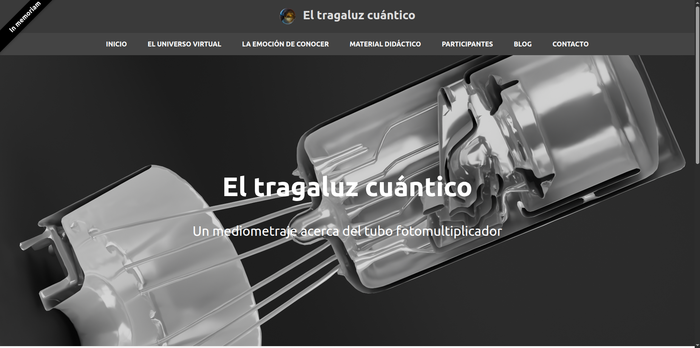
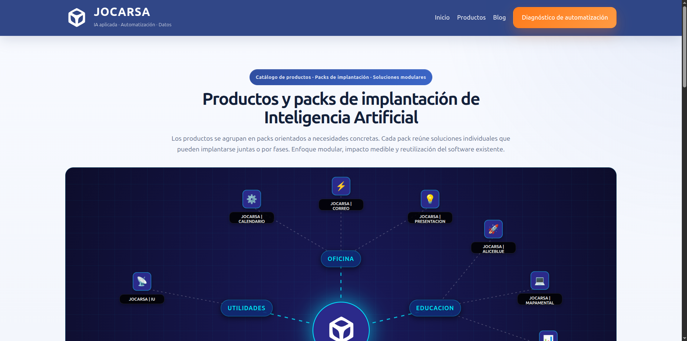
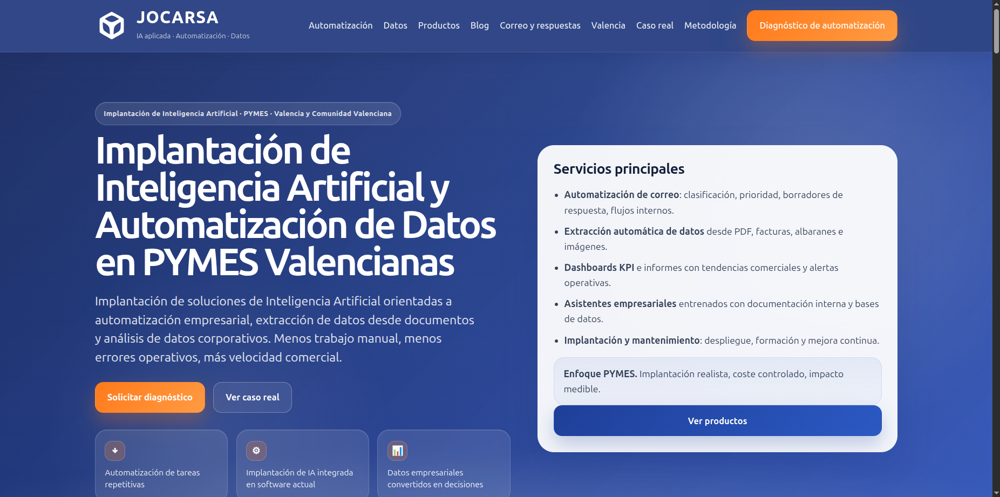
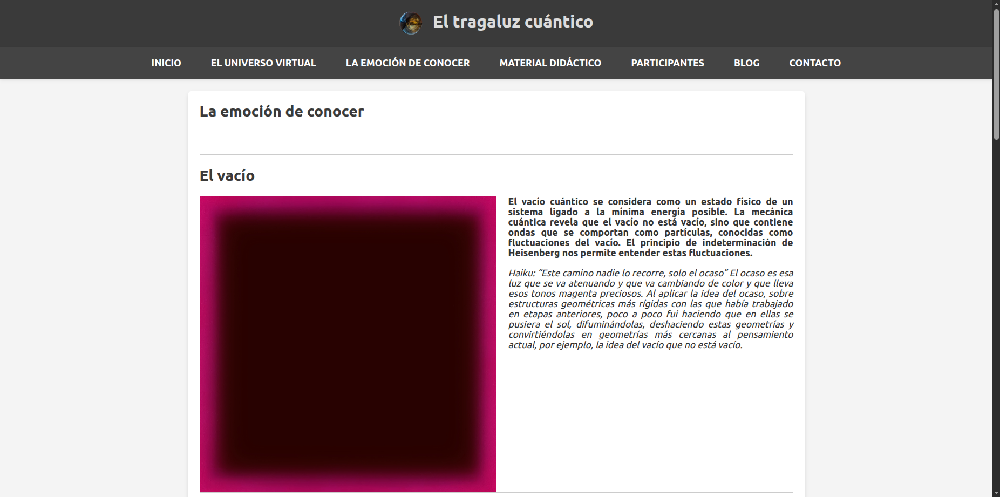
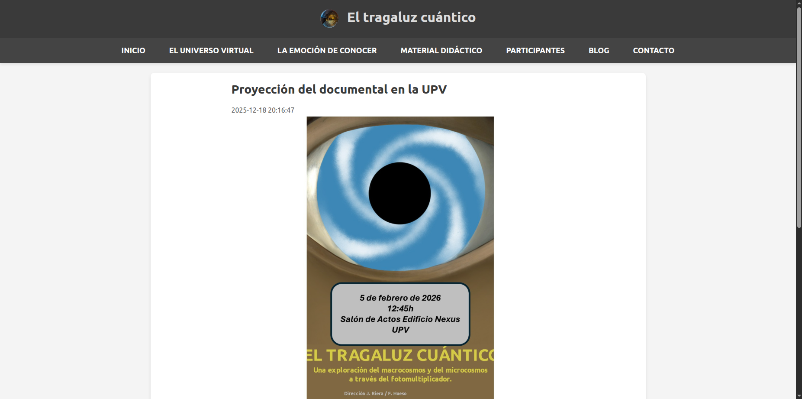
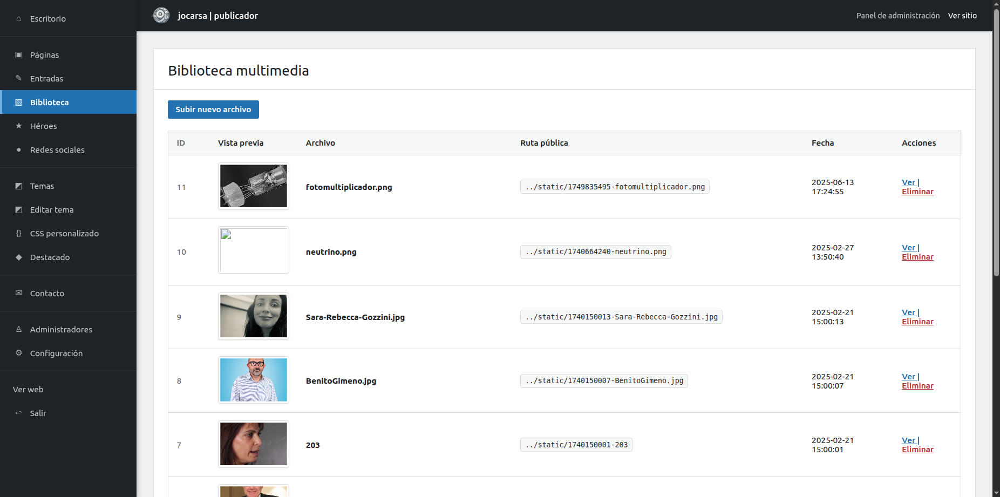
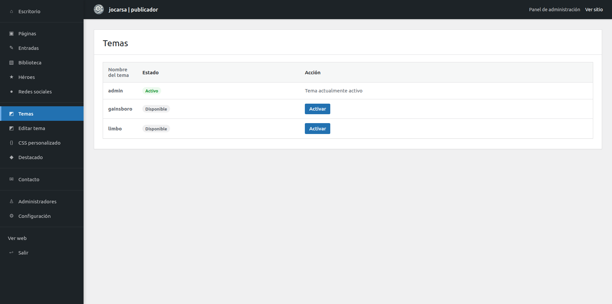
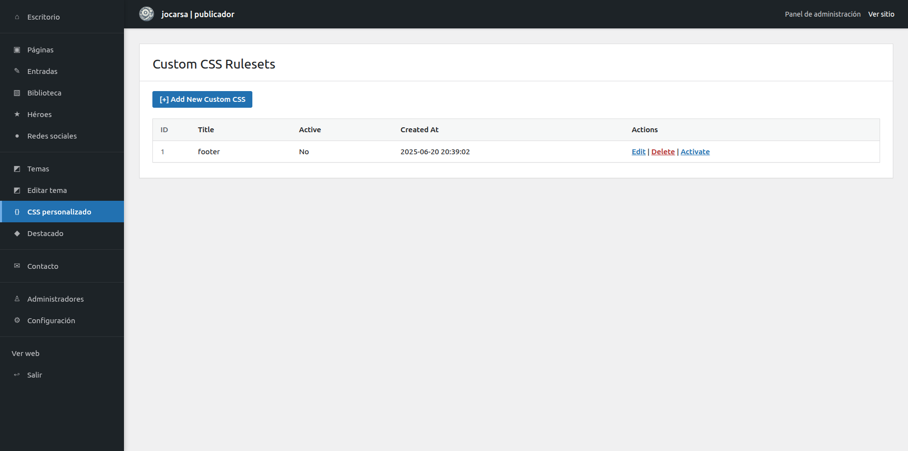
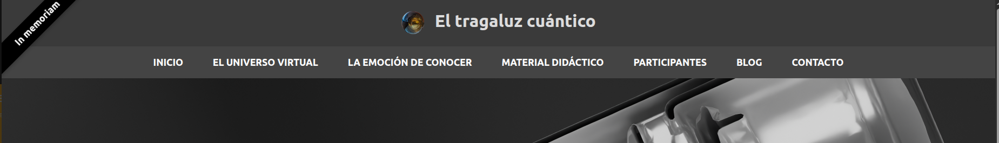

# Manual de usuario de jocarsa | contenido

## Introducción



Bienvenido al manual de usuario de **jocarsa | contenido**.

Este documento está pensado para personas que necesitan gestionar una página web sin tener conocimientos de programación. El objetivo es explicar, paso a paso y con un lenguaje claro, cómo utilizar el sistema para crear páginas, publicar noticias, subir imágenes, modificar textos, cambiar elementos visuales y administrar la información básica del sitio.

**jocarsa | contenido** es un sistema de gestión de contenidos, también conocido como CMS. Un CMS permite administrar una web desde un panel privado, sin tener que editar archivos de código ni modificar directamente la base de datos.

Con este sistema puedes gestionar una web compuesta por páginas, entradas de blog, imágenes, formularios de contacto, redes sociales, temas visuales, elementos destacados y usuarios administradores.

---

# 1. ¿Qué es un Sistema de Gestión de Contenido?


Un Sistema de Gestión de Contenido es una herramienta que permite crear y mantener una página web desde una interfaz de administración.

En lugar de modificar archivos técnicos, el usuario entra en un panel privado y realiza tareas como:

- Crear una nueva página.
- Editar el texto de una página existente.
- Publicar una noticia.
- Subir una imagen.
- Cambiar el aspecto visual de la web.
- Consultar mensajes recibidos desde el formulario de contacto.
- Añadir o modificar enlaces a redes sociales.
- Gestionar usuarios administradores.

La principal ventaja de un CMS es que separa el contenido de la parte técnica. El usuario puede centrarse en la información que quiere publicar, mientras el sistema se encarga de mostrarla correctamente en la web.

---

# 2. Acerca de jocarsa | contenido



**jocarsa | contenido** es un sistema sencillo y directo para gestionar sitios web. Está pensado para proyectos donde se necesita una administración clara, sin depender de herramientas complejas.

El sistema dispone de dos zonas principales:

1. **Frontal o parte pública**  
   Es la web que ven los visitantes.

2. **Panel de administración**  
   Es la zona privada desde la que se gestiona el contenido.

Desde el panel de administración se puede controlar prácticamente todo el contenido visible de la web.

---

# 3. Acerca de jocarsa



**jocarsa** es una línea de soluciones de software orientadas a la productividad, la formación, la gestión empresarial y el desarrollo web.

Sus productos buscan ser sencillos de utilizar, claros en su funcionamiento y adaptables a diferentes necesidades. **jocarsa | contenido** forma parte de esta línea de herramientas.

---

# 4. Conceptos básicos antes de empezar


Antes de utilizar el sistema conviene conocer algunos conceptos importantes.

## 4.1. Página



Una página es una sección fija de la web. Por ejemplo:

- Inicio
- Quiénes somos
- Servicios
- Equipo
- Contacto
- Material didáctico

Las páginas suelen contener información estable, que no cambia todos los días.

## 4.2. Entrada de blog



Una entrada es una noticia o artículo. A diferencia de una página, suele estar asociada a una fecha de publicación.

Por ejemplo:

- Nueva actividad publicada
- Presentación del proyecto
- Jornada de puertas abiertas
- Actualización del curso

Las entradas aparecen dentro de la sección de blog.

## 4.3. Biblioteca de medios



La biblioteca de medios es el lugar donde se guardan los archivos que se suben al sistema, especialmente imágenes.

Por ejemplo:

- Logotipos
- Fotografías
- Fondos
- Imágenes para páginas
- Imágenes para noticias

## 4.4. Héroe


Un héroe es una zona visual destacada que aparece normalmente al inicio de una página. Suele contener:

- Una imagen de fondo.
- Un título.
- Un subtítulo.

Sirve para dar una presentación visual más atractiva a una sección.

## 4.5. Tema



El tema define el aspecto visual general de la web.

Puede controlar elementos como:

- Colores.
- Tipografías.
- Tamaños.
- Distribución de los bloques.
- Estilo de menús.
- Apariencia del pie de página.

## 4.6. CSS personalizado



El CSS personalizado permite añadir pequeños ajustes visuales sobre el tema activo.

Es una opción avanzada. Un usuario no técnico debería utilizarla con cuidado o con ayuda de una persona con conocimientos de diseño web.

## 4.7. Destacado


El destacado es una cinta o aviso especial que puede aparecer en la portada de la web.

Puede utilizarse para llamar la atención sobre algo importante, como:

- Una inscripción abierta.
- Una novedad.
- Una promoción.
- Una noticia relevante.
- Un enlace especial.

---

# 5. Frontal de la web


El frontal es la parte pública del sitio web. Es lo que ven los visitantes cuando acceden a la dirección principal de la página.

Desde el frontal, los visitantes pueden:

- Leer las páginas publicadas.
- Navegar por el menú.
- Consultar el blog.
- Ver entradas individuales.
- Utilizar el formulario de contacto.
- Acceder a redes sociales.
- Ver elementos visuales como héroes o destacados.

## 5.1. Página de inicio


La página de inicio es la primera página que normalmente ve el visitante.

Suele utilizarse para presentar el proyecto, resumir la información principal y orientar al usuario hacia otras secciones.

Puede contener:

- Texto de bienvenida.
- Imagen principal.
- Bloques destacados.
- Enlaces a secciones importantes.
- Mensajes promocionales o informativos.

## 5.2. Menú de navegación



El menú permite moverse entre las páginas principales de la web.

Las páginas creadas desde el panel de administración pueden aparecer automáticamente en la navegación, dependiendo de la configuración y estructura del contenido.

El visitante puede hacer clic en cada opción para acceder a la sección correspondiente.

## 5.3. Submenús


Algunas páginas pueden depender de otras. Por ejemplo:

- Proyecto
  - Equipo
  - Participantes
  - Créditos

En este caso, el sistema puede mostrar una navegación secundaria o submenú para moverse entre páginas relacionadas.

## 5.4. Blog


El blog muestra una lista de entradas o noticias.

Cada entrada puede abrirse de forma individual para leer su contenido completo.

El blog es útil para publicar información actualizada, novedades o comunicaciones periódicas.

## 5.5. Formulario de contacto


La página de contacto permite que los visitantes envíen mensajes.

Normalmente el formulario incluye:

- Nombre.
- Correo electrónico.
- Asunto.
- Mensaje.

Cuando el visitante envía el formulario, el mensaje queda guardado y puede consultarse desde el panel de administración.

## 5.6. Pie de página


El pie de página aparece al final de la web.

Puede incluir:

- Nombre del sitio.
- Logotipo.
- Año actual.
- Enlaces a redes sociales.
- Información institucional.

---

# 6. Panel de administración


El panel de administración es la zona privada desde la que se gestiona el contenido de la web.

Solo deben acceder personas autorizadas.

Desde este panel se pueden realizar tareas como:

- Crear páginas.
- Editar páginas existentes.
- Publicar entradas de blog.
- Subir medios.
- Consultar mensajes de contacto.
- Cambiar temas.
- Modificar la configuración del sitio.
- Gestionar administradores.

## 6.1. Acceso al panel


Para acceder al panel de administración, normalmente se utiliza una dirección similar a:

```text
/admin/admin.php
```

El acceso puede variar según la instalación concreta del sitio.

Al entrar, el sistema mostrará una pantalla de inicio de sesión.

---

# 7. Inicio de sesión


La pantalla de inicio de sesión protege el panel de administración.

Para entrar, el usuario debe introducir:

- Nombre de usuario.
- Contraseña.

Después debe pulsar el botón de acceso.

## 7.1. Qué hacer si no puedes entrar


Si el sistema no permite acceder, revisa lo siguiente:

1. Comprueba que el nombre de usuario esté bien escrito.
2. Comprueba que la contraseña sea correcta.
3. Asegúrate de no tener activadas mayúsculas por error.
4. Si el problema continúa, contacta con otro administrador del sistema.

## 7.2. Recomendaciones de seguridad


Para proteger el sitio:

- No compartas tu contraseña.
- No utilices contraseñas fáciles.
- Cierra sesión al terminar, especialmente en ordenadores compartidos.
- No guardes la contraseña en equipos públicos.
- No crees usuarios administradores innecesarios.

---

# 8. Escritorio


El escritorio es la pantalla principal del panel de administración.

Desde aquí se puede acceder rápidamente a las funciones más importantes.

Puede mostrar:

- Resumen de contenidos.
- Accesos directos.
- Enlaces a páginas frecuentes.
- Estado general de la web.

El escritorio sirve como punto de partida para gestionar el sitio.

---

# 9. Creación y gestión de contenido


La creación de contenido es una de las funciones principales del sistema.

Desde el panel se pueden gestionar dos tipos de contenido principales:

1. **Páginas**, para contenido estable.
2. **Entradas de blog**, para noticias o publicaciones periódicas.

---

# 10. Creación de páginas


Las páginas se utilizan para publicar contenido estable.

Por ejemplo:

- Presentación del proyecto.
- Información institucional.
- Equipo.
- Servicios.
- Materiales.
- Créditos.
- Participantes.

## 10.1. Crear una página nueva


Para crear una página:

1. Entra en el panel de administración.
2. Ve a la sección de páginas.
3. Pulsa la opción para añadir o crear una nueva página.
4. Escribe el título.
5. Escribe el contenido.
6. Si corresponde, selecciona una página padre.
7. Guarda los cambios.

## 10.2. Título de la página


El título identifica la página.

Conviene que sea claro y breve.

Ejemplos correctos:

- Equipo
- Contacto
- Material didáctico
- Participantes

Evita títulos demasiado largos o confusos.

## 10.3. Contenido de la página


El contenido es el texto principal que verá el visitante.

Puede incluir:

- Párrafos explicativos.
- Encabezados.
- Listas.
- Enlaces.
- Imágenes, si el editor lo permite.

Recomendaciones:

- Divide el texto en secciones.
- Utiliza títulos claros.
- Evita bloques de texto demasiado largos.
- Revisa la ortografía antes de publicar.
- Comprueba cómo queda en la parte pública de la web.

## 10.4. Página padre


La página padre permite organizar páginas en niveles.

Por ejemplo:

- Proyecto
  - Equipo
  - Participantes
  - Créditos

En este caso, “Proyecto” sería la página padre de las demás.

Utilizar páginas padre ayuda a crear una navegación más ordenada.

## 10.5. Editar una página existente


Para editar una página:

1. Entra en la sección de páginas.
2. Localiza la página que quieres modificar.
3. Pulsa en editar.
4. Cambia el texto, título o página padre.
5. Guarda los cambios.
6. Revisa el resultado en la web pública.

## 10.6. Eliminar una página


Eliminar una página borra su contenido del sistema.

Antes de eliminar, asegúrate de que:

- La página ya no es necesaria.
- No contiene información importante.
- No hay enlaces que dependan de ella.
- No es una página principal de navegación.

Si tienes dudas, es mejor editar la página o dejarla sin enlazar antes de eliminarla.

---

# 11. Creación de entradas de blog


Las entradas del blog se utilizan para publicar noticias, novedades o artículos.

A diferencia de las páginas, las entradas suelen mostrarse ordenadas por fecha.

## 11.1. Crear una entrada nueva


Para crear una entrada:

1. Entra en el panel de administración.
2. Ve a la sección del blog.
3. Pulsa la opción para añadir una nueva entrada.
4. Escribe el título.
5. Escribe el contenido.
6. Guarda la entrada.
7. Comprueba que aparece correctamente en el blog.

## 11.2. Título de la entrada


El título debe explicar claramente la noticia o artículo.

Ejemplos:

- Nueva actividad disponible
- Presentación del proyecto
- Publicado el material didáctico
- Jornada de divulgación científica

## 11.3. Contenido de la entrada


El contenido debe desarrollar la información.

Una buena entrada suele incluir:

- Introducción breve.
- Desarrollo de la noticia.
- Información práctica.
- Enlaces o referencias si son necesarios.
- Cierre o llamada a la acción.

## 11.4. Fecha de publicación


El sistema registra automáticamente la fecha de creación de la entrada.

Esto permite ordenar las noticias de forma cronológica.

## 11.5. Editar una entrada


Para editar una entrada:

1. Entra en la sección de blog.
2. Busca la entrada.
3. Pulsa editar.
4. Modifica el contenido.
5. Guarda.
6. Comprueba la entrada en la web pública.

## 11.6. Eliminar una entrada


Eliminar una entrada la retira del blog.

Antes de hacerlo, asegúrate de que no será necesaria en el futuro.

Si la entrada contiene información antigua pero todavía útil, puede ser mejor actualizarla en lugar de eliminarla.

---

# 12. Biblioteca de medios


La biblioteca de medios sirve para gestionar archivos utilizados en la web.

Normalmente se utiliza para imágenes.

## 12.1. Para qué sirve


La biblioteca permite:

- Subir imágenes.
- Consultar archivos subidos.
- Usar imágenes en páginas o entradas.
- Eliminar archivos que ya no se necesiten.

## 12.2. Subir un archivo


Para subir un archivo:

1. Entra en el panel de administración.
2. Ve a la biblioteca de medios.
3. Pulsa la opción de subir archivo.
4. Selecciona el archivo desde tu ordenador.
5. Confirma la subida.
6. Comprueba que aparece en la biblioteca.

## 12.3. Recomendaciones para imágenes


Para que la web funcione correctamente:

- Utiliza imágenes con buena calidad.
- Evita archivos demasiado pesados.
- Usa nombres descriptivos.
- Evita espacios y caracteres extraños en los nombres.
- Usa formatos habituales como JPG, PNG, SVG o WEBP, si el sistema los admite.

Ejemplos de nombres adecuados:

```text
equipo-docente.jpg
fondo-inicio.png
logo-proyecto.svg
participantes-2026.jpg
```

Ejemplos menos recomendables:

```text
Imagen final definitiva nueva copia 2.jpg
foto(1).png
aaaaa.jpg
```

## 12.4. Eliminar un archivo


Antes de eliminar un archivo, comprueba que no se está utilizando en ninguna página, entrada, héroe o sección de la web.

Si eliminas una imagen que se está usando, puede dejar de mostrarse correctamente.

---

# 13. Gestión de héroes


Los héroes son bloques visuales destacados asociados a páginas.

Normalmente aparecen en la parte superior de una página y sirven para reforzar visualmente su contenido.

## 13.1. Elementos de un héroe


Un héroe puede incluir:

- Identificador de página.
- Título.
- Subtítulo.
- Imagen de fondo.

## 13.2. Identificador de página


El identificador indica en qué página debe aparecer el héroe.

Debe coincidir con la página correspondiente.

Por ejemplo, si quieres que un héroe aparezca en la página “blog”, el identificador deberá estar asociado a esa sección.

## 13.3. Título del héroe


El título debe ser breve y visual.

Ejemplos:

- Bienvenidos
- Nuestro equipo
- Material didáctico
- La emoción de conocer

## 13.4. Subtítulo del héroe


El subtítulo permite añadir una frase explicativa.

Ejemplos:

- Un espacio para descubrir, aprender y compartir.
- Recursos educativos para comprender mejor el proyecto.
- Conoce a las personas que hacen posible esta iniciativa.

## 13.5. Imagen de fondo


La imagen de fondo debe tener buena calidad y estar relacionada con el contenido.

Recomendaciones:

- Usar imágenes horizontales.
- Evitar imágenes con demasiado texto.
- Elegir imágenes que permitan leer bien el título.
- Comprobar el resultado en móvil y ordenador.

## 13.6. Crear o editar un héroe


Para crear o editar un héroe:

1. Entra en la sección de héroes.
2. Selecciona crear o editar.
3. Indica la página asociada.
4. Escribe título y subtítulo.
5. Indica la imagen de fondo.
6. Guarda.
7. Abre la página pública para comprobar el resultado.

---

# 14. Gestión de redes sociales


La sección de redes sociales permite configurar enlaces que aparecerán en la web, normalmente en el pie de página.

## 14.1. Qué información se gestiona


Cada red social puede tener:

- Categoría.
- Nombre.
- URL.
- Logotipo o icono.

## 14.2. Añadir o modificar una red social


Para modificar una red social:

1. Entra en la sección de redes sociales.
2. Busca la red que quieres editar.
3. Introduce la URL correcta.
4. Guarda los cambios.
5. Revisa el pie de página de la web.

## 14.3. Recomendaciones


- Comprueba que el enlace funciona.
- Usa direcciones completas, empezando por `https://`.
- No publiques redes sociales que estén vacías o sin uso.
- Mantén solo los enlaces relevantes.

Ejemplo:

```text
https://www.youtube.com/...
```

---

# 15. Personalización visual


La personalización permite modificar el aspecto de la web.

El sistema ofrece varias opciones:

- Cambiar de tema.
- Editar un tema.
- Añadir CSS personalizado.
- Configurar un destacado.

---

# 16. Temas


Los temas definen el diseño general del sitio.

Cada tema puede cambiar:

- Colores.
- Tipografía.
- Márgenes.
- Distribución.
- Estilo del menú.
- Apariencia del blog.
- Aspecto del footer.

## 16.1. Cambiar el tema activo


Para cambiar el tema:

1. Entra en el panel.
2. Ve a la sección de temas.
3. Revisa los temas disponibles.
4. Activa el tema deseado.
5. Abre la web pública para comprobar el cambio.

## 16.2. Recomendaciones antes de cambiar tema


Antes de cambiar el tema:

- Comprueba que el nuevo tema se ve bien en la página de inicio.
- Revisa varias páginas internas.
- Revisa el blog.
- Revisa el formulario de contacto.
- Comprueba la visualización en móvil.
- Asegúrate de que los textos se leen correctamente.

---

# 17. Editar tema


Editar un tema es una función avanzada.

Permite modificar directamente el diseño del sitio.

## 17.1. Cuándo usar esta opción


Conviene usarla solo si:

- Sabes exactamente qué cambio quieres hacer.
- Tienes conocimientos básicos de diseño web.
- Has realizado una copia de seguridad.
- Puedes revertir el cambio si algo sale mal.

## 17.2. Riesgos de editar un tema


Un cambio incorrecto puede provocar:

- Colores ilegibles.
- Elementos descolocados.
- Menús mal alineados.
- Páginas visualmente rotas.
- Problemas en móviles.

Por eso se recomienda precaución.

---

# 18. CSS personalizado


El CSS personalizado permite añadir reglas visuales sin modificar directamente el tema principal.

Es útil para ajustes concretos.

## 18.1. Ejemplos de uso


Puede servir para:

- Cambiar el color de un botón.
- Aumentar el tamaño de un título.
- Ajustar el margen de una sección.
- Ocultar un elemento concreto.
- Cambiar el estilo de una zona especial.

## 18.2. Activar o desactivar CSS personalizado


El sistema permite tener varias reglas CSS y activar o desactivar cada una.

Esto es útil porque permite probar cambios sin eliminarlos.

## 18.3. Recomendación para usuarios no técnicos


Si no tienes conocimientos de CSS, no modifiques esta sección sin ayuda.

Un error en CSS no suele borrar contenido, pero puede afectar al aspecto de la web.

---

# 19. Destacado


El destacado permite mostrar una cinta diagonal en la portada.

Sirve para llamar la atención sobre una información importante.

## 19.1. Campos del destacado


La configuración puede incluir:

- Activar destacado.
- Mensaje.
- Enlace.
- Color de fondo.

## 19.2. Activar el destacado


Para activarlo:

1. Entra en la sección destacado.
2. Marca la opción de activar.
3. Escribe el mensaje.
4. Introduce el enlace.
5. Selecciona el color.
6. Guarda los cambios.
7. Abre la portada para comprobar que se muestra.

## 19.3. Mensaje


El mensaje debe ser breve.

Ejemplos:

- Inscripción abierta
- Nueva actividad
- Ver novedades
- Curso disponible
- Proyecto destacado

## 19.4. Enlace


El enlace indica a dónde irá el visitante al hacer clic.

Puede ser:

- Una página interna.
- Una entrada de blog.
- Una web externa.
- Un documento o recurso.

## 19.5. Color


El color debe destacar, pero sin dificultar la lectura.

Conviene elegir colores con buen contraste.

## 19.6. Cuándo usar el destacado


Úsalo para información realmente importante.

Si siempre hay un destacado activo, los visitantes pueden dejar de prestarle atención.

---

# 20. Contacto


La sección de contacto permite consultar los mensajes enviados por los visitantes.

## 20.1. Formulario público


El visitante completa un formulario con:

- Nombre.
- Correo electrónico.
- Asunto.
- Mensaje.

Cuando envía el formulario, el mensaje queda guardado.

## 20.2. Consultar mensajes


Para consultar mensajes:

1. Entra en el panel de administración.
2. Ve a la sección de contacto.
3. Revisa el listado de mensajes.
4. Abre el mensaje que quieras leer.

## 20.3. Recomendaciones de gestión


- Revisa los mensajes periódicamente.
- Responde a los usuarios por correo electrónico.
- Elimina mensajes de prueba o spam si procede.
- Conserva los mensajes importantes.

## 20.4. Privacidad


Los mensajes pueden contener datos personales.

Trátalos con cuidado y evita compartirlos con personas no autorizadas.

---

# 21. Gestión de usuarios


La gestión de usuarios permite crear y mantener cuentas de administración.

Solo las personas responsables de mantener la web deberían tener acceso.

---

# 22. Administradores


Los administradores pueden entrar al panel y gestionar el sitio.

## 22.1. Crear un administrador


Para crear un administrador:

1. Entra en la sección de administradores.
2. Pulsa añadir administrador.
3. Introduce nombre completo.
4. Introduce email.
5. Introduce nombre de usuario.
6. Introduce contraseña.
7. Guarda.

## 22.2. Editar un administrador


Para editar:

1. Localiza el administrador.
2. Pulsa editar.
3. Modifica los datos necesarios.
4. Si no quieres cambiar la contraseña, deja el campo correspondiente vacío.
5. Guarda.

## 22.3. Eliminar un administrador


Antes de eliminar un administrador, comprueba que:

- Esa persona ya no necesita acceso.
- No es la única cuenta disponible.
- Hay al menos otro administrador activo.

## 22.4. Buenas prácticas


- Crea solo las cuentas necesarias.
- No compartas usuarios entre varias personas.
- Cada administrador debería tener su propia cuenta.
- Cambia las contraseñas si sospechas que alguien no autorizado las conoce.

---

# 23. Configuración


La configuración permite modificar datos generales del sitio.

Esta sección afecta a elementos globales de la web.

## 23.1. Datos habituales de configuración


Puede incluir:

- Título del sitio.
- Logotipo.
- Descripción para buscadores.
- Palabras clave.
- Autor.
- Tema activo.
- Imagen del pie de página.
- Usuario de analítica.

## 23.2. Título del sitio


El título aparece normalmente en la cabecera y en la pestaña del navegador.

Debe representar claramente el sitio.

Ejemplo:

```text
jocarsa | contenido
```

## 23.3. Logotipo


El logotipo se muestra en la cabecera o en otras zonas del sitio.

Debe ser una imagen válida y accesible.

## 23.4. Meta descripción


La meta descripción es un texto breve que describe la web.

Puede ser utilizada por buscadores.

Recomendaciones:

- Que sea clara.
- Que no sea demasiado larga.
- Que explique la finalidad del sitio.

Ejemplo:

```text
Sitio web de contenidos, noticias y recursos del proyecto.
```

## 23.5. Palabras clave


Las palabras clave ayudan a describir los temas principales del sitio.

Ejemplo:

```text
educación, contenidos, proyecto, blog, recursos
```

## 23.6. Autor


Indica el autor o responsable del sitio.

## 23.7. Tema activo


Define qué tema visual se está utilizando actualmente.

Normalmente es mejor cambiar el tema desde la sección de temas, no modificando manualmente este valor.

## 23.8. Imagen del footer


Es la imagen que puede aparecer en el pie de página.

## 23.9. Analítica


El sistema puede cargar un script de analítica para registrar visitas.

El valor de usuario de analítica identifica el sitio dentro del sistema correspondiente.

---

# 24. Salir del panel


Cuando termines de trabajar, es recomendable cerrar sesión.

Para salir:

1. Pulsa la opción “Salir” o “Cerrar sesión”.
2. El sistema finalizará la sesión.
3. Volverás a la pantalla de inicio de sesión.

Cerrar sesión es especialmente importante si trabajas en un ordenador compartido.

---

# 25. Flujo de trabajo recomendado


Para trabajar de forma ordenada, se recomienda seguir este flujo.

## 25.1. Para crear una nueva sección


1. Crear la página.
2. Escribir el contenido.
3. Añadir imágenes si son necesarias.
4. Crear un héroe si se quiere una cabecera visual.
5. Revisar el resultado en la web pública.
6. Corregir textos o diseño si hace falta.

## 25.2. Para publicar una noticia


1. Crear una entrada de blog.
2. Escribir título claro.
3. Redactar el contenido.
4. Añadir enlaces o imágenes si procede.
5. Guardar.
6. Comprobar que aparece en el blog.

## 25.3. Para actualizar la imagen de una página


1. Subir la nueva imagen a la biblioteca.
2. Copiar o identificar su ruta.
3. Editar el héroe o contenido correspondiente.
4. Guardar.
5. Revisar la página pública.

## 25.4. Para destacar una novedad en portada


1. Entrar en destacado.
2. Activarlo.
3. Escribir mensaje breve.
4. Añadir enlace.
5. Elegir color.
6. Guardar.
7. Revisar la portada.

---

# 26. Consejos de redacción


Una web clara depende mucho de cómo se redacta el contenido.

## 26.1. Escribe para el visitante


Antes de publicar, piensa:

- ¿Quién va a leer esto?
- ¿Qué necesita saber?
- ¿Qué acción quiero que realice?
- ¿Está explicado de forma sencilla?

## 26.2. Usa títulos claros


Los títulos ayudan a orientarse.

Ejemplos:

- Qué ofrecemos
- Cómo participar
- Material disponible
- Preguntas frecuentes

## 26.3. Evita textos demasiado largos


Si una página tiene mucho contenido, divídela en secciones.

Utiliza:

- Párrafos cortos.
- Listas.
- Subtítulos.
- Enlaces.

## 26.4. Revisa antes de publicar


Antes de dar por terminada una página:

- Revisa ortografía.
- Comprueba enlaces.
- Comprueba imágenes.
- Lee el texto como si fueras un visitante.
- Abre la página desde la parte pública.

---

# 27. Consejos sobre imágenes


Las imágenes influyen mucho en la calidad visual del sitio.

## 27.1. Usa imágenes adecuadas


Una buena imagen debe:

- Tener buena resolución.
- Estar relacionada con el contenido.
- No estar deformada.
- No ser excesivamente pesada.
- Tener derechos de uso adecuados.

## 27.2. Imágenes para héroes


Para los héroes, se recomiendan imágenes horizontales y amplias.

Evita imágenes donde el contenido importante esté muy pegado a los bordes, porque puede recortarse en pantallas pequeñas.

## 27.3. Peso de las imágenes


Imágenes demasiado grandes pueden hacer que la web cargue lentamente.

Antes de subir imágenes muy pesadas, conviene reducirlas o comprimirlas.

---

# 28. Revisión después de publicar


Después de guardar cambios, no basta con confiar en el panel. Siempre es recomendable revisar la web pública.

Comprueba:

- Que el contenido aparece.
- Que no hay errores de escritura.
- Que los enlaces funcionan.
- Que las imágenes cargan.
- Que la página se ve bien en móvil.
- Que el menú sigue siendo claro.

---

# 29. Errores habituales y soluciones


## 29.1. No aparece una página nueva


Posibles causas:

- No se ha guardado correctamente.
- El título no coincide con el enlace esperado.
- La página depende de otra página padre.
- Hay que actualizar la página del navegador.

Solución:

- Vuelve al listado de páginas.
- Comprueba que la página existe.
- Ábrela desde el frontal.
- Revisa su título y jerarquía.

## 29.2. Una imagen no se ve


Posibles causas:

- La ruta de la imagen no es correcta.
- El archivo fue eliminado.
- El nombre contiene caracteres problemáticos.
- La imagen no terminó de subirse.

Solución:

- Comprueba que la imagen aparece en la biblioteca.
- Vuelve a seleccionarla o indicar su ruta.
- Usa nombres sencillos para los archivos.

## 29.3. El destacado no aparece


Posibles causas:

- No está activado.
- Falta el mensaje.
- Falta el enlace.
- Falta el color.
- No estás viendo la portada.

Solución:

- Revisa la configuración del destacado.
- Comprueba que todos los campos están completos.
- Abre la página de inicio.

## 29.4. El formulario de contacto no guarda mensajes


Posibles causas:

- Faltan campos obligatorios.
- El visitante no completó el formulario.
- Hay un problema técnico de permisos o base de datos.

Solución:

- Prueba a enviar un mensaje de ejemplo.
- Comprueba el panel de contacto.
- Si persiste, contacta con el responsable técnico.

## 29.5. El diseño se ve raro después de un cambio


Posibles causas:

- Se ha activado otro tema.
- Se ha añadido CSS personalizado incorrecto.
- Se ha editado un tema con un error.
- El navegador conserva una versión antigua en caché.

Solución:

- Revisa el tema activo.
- Desactiva temporalmente el CSS personalizado.
- Recarga la página.
- Consulta con la persona responsable si el problema continúa.

---

# 30. Seguridad básica


Aunque el sistema sea sencillo, es importante mantener buenas prácticas.

## 30.1. Contraseñas


Usa contraseñas:

- Largas.
- Difíciles de adivinar.
- Diferentes a las de otros servicios.

Evita contraseñas como:

```text
123456
admin
password
jocarsa
```

## 30.2. Usuarios


No crees usuarios innecesarios.

Si una persona deja de necesitar acceso, elimina o desactiva su cuenta.

## 30.3. Sesiones


Cierra sesión al terminar.

No dejes el panel abierto en ordenadores compartidos.

## 30.4. Cambios importantes


Antes de hacer cambios grandes:

- Anota qué vas a modificar.
- Haz una copia del contenido importante.
- Comprueba el resultado después.
- Evita cambiar muchas cosas a la vez.

---

# 31. Copias de seguridad


El contenido del sitio depende de archivos y base de datos.

Es recomendable realizar copias de seguridad periódicas.

## 31.1. Qué conviene guardar


- Base de datos.
- Imágenes y archivos subidos.
- Temas CSS.
- Archivos de configuración.
- Código del sitio, si procede.

## 31.2. Cuándo hacer copia


Especialmente antes de:

- Cambiar temas.
- Editar CSS.
- Hacer limpieza de medios.
- Eliminar muchas páginas.
- Actualizar el sistema.

---

# 32. Buenas prácticas generales


Para mantener la web ordenada:

- Usa títulos claros.
- No dupliques páginas innecesariamente.
- Elimina contenido obsoleto con cuidado.
- Revisa el blog periódicamente.
- Mantén actualizados los enlaces.
- No subas imágenes gigantes sin optimizar.
- Comprueba la web pública después de cada cambio.
- Mantén pocos administradores.
- Usa el destacado solo para avisos importantes.

---

# 33. Resumen de secciones del panel


## Inicio de sesión


Permite entrar al panel privado.

## Escritorio


Pantalla principal con accesos y resumen.

## Páginas


Gestiona contenido fijo del sitio.

## Blog


Gestiona noticias y artículos.

## Biblioteca


Gestiona imágenes y archivos.

## Héroes


Gestiona cabeceras visuales por página.

## Redes sociales


Gestiona enlaces sociales del sitio.

## Temas


Permite cambiar el diseño general.

## Editar tema


Permite modificar archivos visuales del tema.

## CSS personalizado


Permite añadir ajustes visuales adicionales.

## Destacado


Permite mostrar un aviso especial en portada.

## Contacto


Permite consultar mensajes recibidos.

## Administradores


Permite gestionar usuarios del panel.

## Configuración


Permite cambiar datos globales del sitio.

## Salir


Cierra la sesión del usuario.

---

# 34. Glosario


## CMS


Sistema de Gestión de Contenido. Herramienta para administrar una web desde un panel.

## Frontal


Parte pública de la web que ven los visitantes.

## Panel de administración


Zona privada desde la que se gestiona la web.

## Página


Contenido fijo o estable del sitio.

## Entrada


Publicación del blog, normalmente ordenada por fecha.

## Biblioteca de medios


Lugar donde se guardan imágenes y archivos.

## Héroe


Bloque visual destacado asociado a una página.

## Tema


Conjunto de estilos que define el aspecto de la web.

## CSS


Lenguaje usado para definir la apariencia visual de una web.

## Destacado


Aviso visual especial que aparece en la portada.

## Administrador


Usuario con permisos para gestionar el sitio.

---

# 35. Conclusión


**jocarsa | contenido** permite gestionar una web de forma clara y sencilla desde un panel de administración.

Un usuario no programador puede utilizarlo para mantener páginas, publicar noticias, subir imágenes, revisar mensajes y realizar cambios básicos de diseño.

La recomendación principal es trabajar siempre de forma ordenada: crear contenido con títulos claros, revisar los cambios en la parte pública y actuar con precaución al modificar opciones visuales o eliminar información.

---

# Autor


José Vicente Carratalá  
jocarsa
